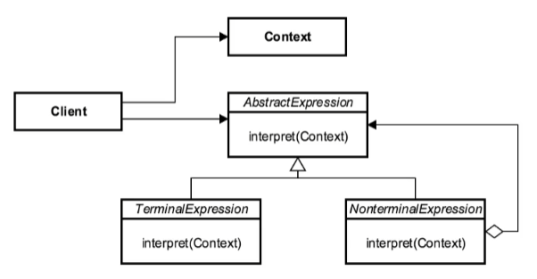

# Interpreter Design Pattern

* The **Interpreter Design Pattern** is one of the _Gang of Four design patterns_ which specifies how to evaluate sentences in a language.

* The **Interpreter** pattern is a behavioral pattern that provides a way to evaluate language grammar or expression.

* The **Interpreter** pattern uses an expression interface that tells how to interpret a particular context.

* The **Interpreter** pattern is used to define a grammatical representation for a language also provides an interpreter to deal with the grammar.

* The basic idea of the **Interpreter** pattern is to have a class for each symbol:

    * **Terminal** - are the elementary symbols of the language defined by a formal grammar.

    * **NonTerminal** -  also known as syntactic variables that are replaced by groups of terminal symbols according to the production rules. The NonTerminal uses a **composite design pattern** in general.

* A grammar is defined by production rules that specify which symbols may replace which other symbols. The production rules or simply called productions may be used to generate and parse strings.

* SQL interpreter is a good example of this pattern.

* Language interpreters are another great example of this.

* I have also used the Interpreter pattern in the example of the [Command Design Pattern](../command) for interpreting the appliance and its operation to perform in the command string.

### Concepts

* Represent grammar
* Interpret a sentence
* Map a domain
* AST
* Examples:
    * `java.util.Pattern`
    * `java.text.Format`

### Design Considerations

* AbstractExpression
* Interpret
* TerminalExpression
* NonTerminalExpression
* Context, AbstractExpression, TerminalExpression, NonTerminalExpression, Client

### UML Diagram

### Reference

1. https://dzone.com/articles/using-interpreter-design-pattern-in-java