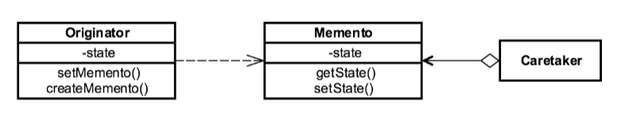

# Memento Design Pattern

* The **Memento Design Pattern** is one of the twenty-three well-known _GoF design patterns_ that provide the ability
to restore an object to its previous state.

* The **Memento Design Pattern** is implemented with the help of three objects: the _originator_, a _caretaker_, and a _memento_.

    * **Originator** — The object whose internal state we like to store.
    The **Originator** object creates a memento object to store its internal state.
    So, the **Originator** object knows how to save and restore itself.
    The object which gets and sets the values of **Memento** objects.

    * **Caretaker** — The object which knows why and when the **Originator** needs to save and restore itself.
    The object operates on the **Originator** while having the possibility to rollback.
    It maintains the history of the **Memento** objects created.
    The caretaker takes a snapshot of **Originator** before operating.

    * **Memento** — The POJO object that contains basic `state` storage and retrieval capabilities.
      The Memento object is _immutable_ in general.
      The object holds the internal state of the Originator and allows it to restore it.

* The classic example of the Memento Pattern is a _pseudorandom number generator_ or _finite state machine_.

* Git stashing is another example of the **Memento Design Pattern**.

* The internal state of the **Originator** object should be saved externally so that the object can be restored to this state later.
Also, the object's encapsulation must not be violated.

* The caretaker requests a **Memento** from **Originator** before operating.
And use that **Memento** to restore the **Originator** to its previous state if needed.

* We can make **Memento Design Pattern** implementation more generic by using `Serialization`;
that will eliminate the requirement of every class having its own **Memento** class.

* The **Memento Design Pattern** can also be used with the [Command Design Pattern](../command) for achieving undo of the commands.

### Concepts

* Restore Objects to previous state
* Externalize internal state
* Undo/Rollback
* Shields complex internals
* Examples:
    * `java.util.Date`
    * `java.io.Serializable`

### Design Considerations

* Class based
* Originator
* Caretaker
* Memento
* Magic Cookie

### UML Diagram

### Reference

1. https://dzone.com/articles/memento-design-pattern-in-java