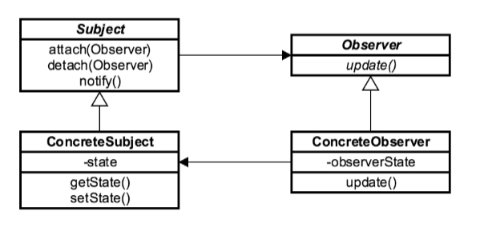

# Observer Design Pattern

The **Observer Design Pattern** maintains one-to-many dependency between **Subject** (**Observable**) and its
**dependents** (**Observer**) in such a way that whenever state of **Subject** changes, its dependents get notified.

The **Observer Design Pattern** is a design pattern in which an object, called the **subject**, maintains a list of its
dependents, called **observers**, and notifies them automatically of any state changes, usually by calling one of their methods.

The **Observer Design Pattern** is used when we like to have notification upon changes in the objects state.

The **Observer Design Pattern** is one of twenty-three well-known Gang of Four design patterns that defines an one-to-many
dependency objects so that when one object changes state, all of its dependents get notified and updated automatically.

The **Observer Design Pattern** is mainly used to implement distributed event handling , in "**event driven**" system.

In such systems, the **subject** is usually called a "**source of events**", while the observers are called "**sink of events**".

Most modern languages have built-in "event" constructs which implement the **observer** pattern components.

Java also offers `Observer` and `Observable` to support built-in event constructs for implementing observer pattern.
These are available since Java 1.

But, in Java 9 these are declared **deprecated/obsolete** because the event model supported by `Observer` and `Observable`
is quite limited, the order of notifications delivered by `Observable` is unspecified, and state changes are not in
one-for-one correspondence with notifications. For a richer event model, consider using the `java.beans` package.
For reliable and ordered messaging among threads, consider using one of the concurrent data structures in the `java.util.concurrent` package.
For reactive streams style programming, see the `Flow` API.

### Concepts

* One to Many
* Decoupled
* Event Handling
* Pub/Sub
* M-V-C
* Examples:
    * `java.util.Observer`
    * `java.util.EventListener`
    * `javax.jms.Topic`

### Design Considerations

* Subject
* Observer
* Observable
* Views are Observers
* Subject, ConcreteSubject, Observer, ConcreteObserver

### UML Diagram

### Pitfalls

* Unexpected updates
* Large sized consequences
* What changed
* Debugging difficult

### Reference

1. https://dzone.com/articles/observer-design-pattern-in-java