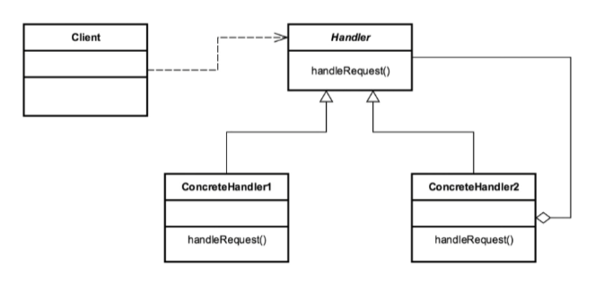

# Chain of Responsibility Design Pattern

* The **Chain of Responsibility Design Pattern** is one of the _Gang of Four design patterns_ which creates a chain of receiver objects for a request.

* The **Chain of Responsibility** pattern is a behavioral pattern which is used to avoid coupling the sender of the request to the receiver and gives more than one receiver object the opportunity to handle the request.

* As per Gang of Four design patterns, the **Chain of Responsibility** pattern is defined as:
    > "Gives more than one object an opportunity to handle a request by linking receiving objects together."

* The **Chain of Responsibility** pattern allows a number of classes to attempt to handle a request independently.

* The **Receiver** objects of the requests are free from the order and can be use in any order for processing.

* This pattern decouples sender and receiver objects based on type of request.

* This pattern defines a chain of receiver objects having the responsibility, depending on run-time conditions, to either handle a request or forward it to the next receiver on the chain.

* This pattern helps us avoid coupling of sender and receiver objects of a requests and allows us to have more than one receiver as well for the request.

### Concepts

* Decoupling of sender and receiver
* Receiver contains reference to next receiver
* Promote Loose coupling
* No Handler - OK
* Examples:
    * `java.util.logging.Logger#log()`
    * `javax.servlet.Filter#doFilter()`
    * Spring Security Filter Chain

### Design Considerations

* Chain of receiver objects
* Handler is Interface based
* Concrete Handler for each implementation
* Each Handler has a reference to the next
* Handler, ConcreteHandler

### UML Diagram

### Reference

1. https://dzone.com/articles/using-chain-of-responsibility-design-pattern-in-ja