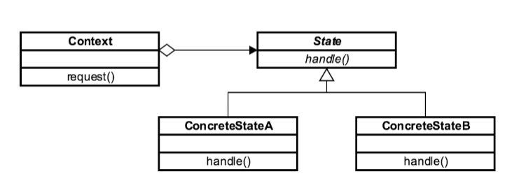

# State Design Pattern

* The **State Design Pattern** is a Behavioral Design Pattern and one of the _Gang of Four design patterns_.

* The **State** allows an object to _alter_ its behavior when its _internal state_ changes.

* The **State** pattern is similar to the concept of finite-state machines.

* The **State** pattern is also similar to the Strategy Design Pattern which provides a way to switch a strategy
 through invocations of methods defined in the pattern's interface.

* The **State** pattern encapsulates varying behavior for the object based on its internal state change.

* The **State** pattern provides a cleaner way for an object to change its behavior at runtime.

* By using the **State** pattern, the object changes its behavior when its internal state changes.

* If we implement State-Specific behavior directly in the class, then we will not be able to change it without modifying the class.

* In-State pattern, State-specific behavior should be defined independently because adding new states should not
affect the behavior of existing states.

* The context class delegates state-specific behavior to its current state object instead of implementing
state-specific behavior directly.

* This allows us to make our context class independent of how state-specific behavior is implemented.
 New state classes can be added without modifying context class.

* The context class can change its behavior at run-time by changing its current state object.

* To implement the **State Design Pattern**, we create a State interface to define some action.
And then concrete classes that represent various states and a _context object_ whose behavior varies as its state object changes.

* Java `Threads` are another good example of **State** pattern since they have defined states as
_New, Runnable, Blocked, Waiting, Timed Waiting_ and _Terminated_.

### Concepts

* Localize state behavior
* State Object
* Separates What from Where
* OCP
* Examples:
    * None!
    * JSF
    * Iterator

### Design Considerations

* Abstract Class / Interface
* Class based
* Context unaware
* Context, State, ConcreteState

### UML Diagram

### Reference

1. https://dzone.com/articles/state-design-pattern-in-java-1