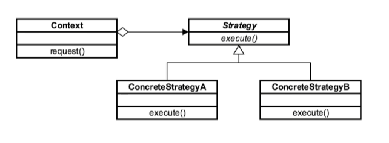

# Strategy Design Pattern

The strategy design pattern (also known as the policy design pattern) is a behavioral design pattern that allows us to
select an algorithm at runtime. In this pattern, the code receives run-time instructions to decide which group of the algorithms to use.

Strategy design patterns make the algorithm vary independently of the context, clients, and codes that use it.

For example, a validating object that performs validation on data received may use the strategy pattern to select a
validation algorithm, depending on the type, source of data, or based on other user parameters.

These validation algorithms will be written separately from the validating object and, hence, can easily be used by
different validating objects without any code duplication. Any validating object can also use different validation algorithms,
as well, based on type, source, or user input.

The strategy pattern stores a reference to some algorithm or code and supplies it wherever required.

So, in short, the strategy design pattern is one of the many defined algorithms in the design pattern family,
which may be applied or used on data.

The ability to decide which algorithm to use at runtime allows the calling or client code to be more flexible
and reusable and avoids code duplication.

The client or context does not know which strategy (algorithm) it has to use.

### Concepts

* Eliminate conditional statements
* Behaviour encapsulated in classes
* Difficult to add new strategies
* Client aware of strategies
* Client chooses strategy
* Examples:
    * `java.util.Comparator`

### Design Considerations

* Abstract base class
* Concrete class per strategy
* Removes if/else conditionals
* Strategies are independent
* Context, Strategy, ConcreteStrategy

### UML Diagram

### Pitfalls

* Client aware of Strategies
* Increased number of classes

### Reference

1. https://dzone.com/articles/strategy-vs-factory-design-pattern-in-java