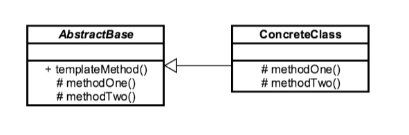

# Template Method Design Pattern

The **Template Method** pattern is one of the behavioral design patterns identified by Gamma et al. in the book _Design Patterns_.

The **Template Method** pattern provides a method in a super-class, usually an abstract super-class, and defines the
skeleton of an operation in terms of several high-level steps.

Generally, these steps are implemented by additional _helper methods_ in the same class as the template method.

The _helper methods_ may be either created as an _abstract method_, for which sub-classes are required to provide concrete
implementations, or _hook methods_, which have empty bodies in the super-class.

The **Template Method** design pattern is used to define an algorithm as a skeleton of operations and leave the details
to be implemented by the child classes.

In this way of implementation, the overall structure and sequence of the algorithm are preserved by the parent class.

The **Template Method** pattern defines the sequential steps to execute a multi-step algorithm.
We can provide a default implementation as well.

In the **Template Method** pattern, we define a preset structure method called _template method_ which consists of steps.

These steps can be created as an _abstract method_ which will be implemented by its sub-classes.

In the **Template Method** pattern, an abstract class exposes defined way(s)/template(s) to execute its methods.

The _template method_ uses and defines the sequence of steps to perform the algorithm.

### Concepts

* Code reuse
* Common in libraries/frameworks
* IoC
* Algorithm emphasis
* Examples:
    * `java.util.Collections#sort()`
    * `java.util.AbstractList#indexOf()`

### Design Considerations

* Abstract Base class
* Base calls child
* Hooks
* Operations
* AbstractBase, ConcreteClass

### UML Diagram

### Pitfalls

* Restrict access
* Confusing hierarchy
* Difficult Program flow

### Reference

1. https://dzone.com/articles/using-template-method-design-pattern-in-java