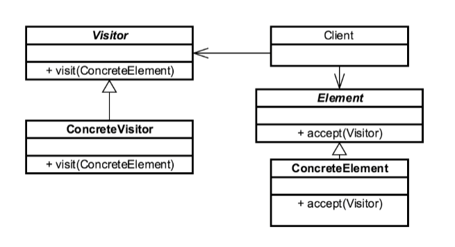

# Visitor Design Pattern

* The **Visitor Design Pattern** provides a way of separating an algorithm from an object structure on which it operates.

* A practical result of this separation is the ability to add new operations to existing object structures without modifying the structures.
It is one way to follow the open/closed principle.

* The **Visitor Design Pattern** is used when we like to perform an operation on a group/family of objects.

* The **Visitor Design Pattern** is one of the twenty-three well-known _GoF design patterns_ which helps us to move the
operational logic from the objects to another class.

* The **Visitor** allows adding new virtual functions to a family of classes, without modifying the classes.

* Instead, a **visitor** class is created that implements all the appropriate specializations of the virtual function.

* The Visitor Design Pattern makes it possible to define a new operation for (some) classes of an object structure without changing the classes.

* When new operations are needed frequently, and the object structure consists of many unrelated classes,
it's inflexible to add new sub-classes each time a new operation is required.

* The **Element** _accepts_ the visitor and delegates the operation to the accepted **Visitor** object.

* The **Visitor** object performs the operation on the element ("_visits the element_").

* The **Visitor Design Pattern** makes it possible to create _new operations independently_ of the classes of an object
structure by adding new visitor objects.

### Concepts

* Separate Algorithm from Object
* Adding new features
* Maintain Open/Closed principle
* Visitor changes
* Examples:
    * `java.lang.model.element.Element`
    * `java.lang.model.element.ElementVisitor`

### Design Considerations

* Interface based
* Visitor and Element
* Elements have visit method
* Visitor knows every Element
* Visitor, ConcreteVisitor, Element, ConcreteElement

### UML Diagram

### Reference

1. https://dzone.com/articles/visitor-design-pattern-in-java